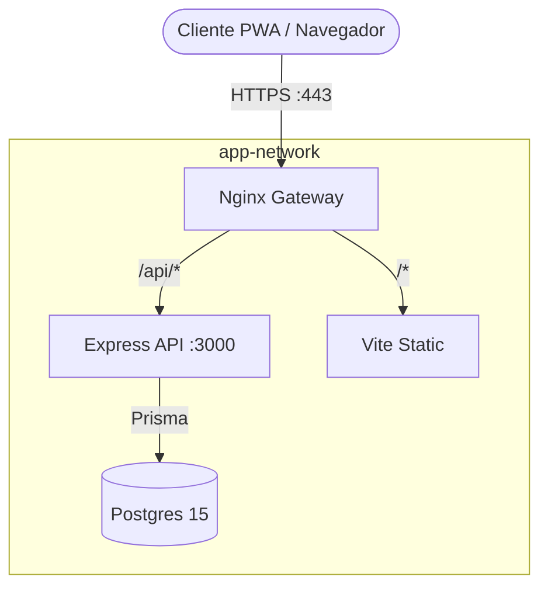

# Gestión de Turnos Auteide (v1.0) 🚀


**Gestión de Turnos Auteide** es una Progressive Web App (PWA) integral, diseñada profesionalmente para la administración centralizada y eficiente de turnos en sucursales. El sistema ofrece una interfaz reactiva, un robusto control de accesos (RBAC) y un despliegue simplificado mediante contenedores Docker.

---

## ✨ Características Principales

- 🔐 **Sistema RBAC Avanzado:** 5 niveles de permisos (Empleado, Responsable, Jefe de Departamento, Administración y Admin).
- 📅 **Gestión de Turnos:** Creación, edición y visualización dinámica de cuadrantes laborales.
- 🏝️ **Módulo de Vacaciones:** Seguimiento detallado y ajustes de días de descanso.
- 📋 **Tablero de Anuncios:** Comunicación interna con anuncios globales y específicos por sucursal.
- 🛡️ **Auditoría Integral:** Registro detallado de acciones críticas (IP, payload y usuario) en el sistema.
- 📱 **PWA Ready:** Instalable en dispositivos móviles con interfaz optimizada para pantallas táctiles.
- 🔄 **Backups Automáticos:** Sistema interno para la generación y gestión de copias de seguridad de la base de datos.

---

## 🛠️ Stack Tecnológico

| Componente | Tecnología |
|---|---|
| **Frontend** | React 18, Vite, Tailwind CSS, Lucide React |
| **Backend** | Node.js, Express.js |
| **Persistencia** | PostgreSQL 15, Prisma ORM |
| **Infraestructura** | Docker Compose, Nginx (Reverse Proxy & SSL) |

---

## 🚀 Instalación Rápida con Docker

Para levantar el entorno completo de producción (Frontend, Backend, DB y Nginx), asegúrate de tener instalado [Docker](https://www.docker.com/) y sigue estos pasos:

1. **Clona el repositorio:**
   ```bash
   git clone https://github.com/AitorGC/AppTurnosSucursal.git
   cd AppTurnosSucursal
   ```

2. **Configura las variables de entorno:**
   ```bash
   cp .env.example .env
   # Edita el archivo .env con tus credenciales
   ```

3. **Levanta los contenedores:**
   ```bash
   docker compose up -d --build
   ```

El proyecto estará disponible en `https://localhost` (o el dominio configurado).

---

## 🏗️ Arquitectura del Sistema

El proyecto utiliza una arquitectura dockerizada para garantizar la consistencia entre entornos:



---

## 👥 Roles y Permisos

- **`employee`:** Acceso base a turnos y perfil.
- **`responsable`:** Gestión de cuadrantes y usuarios de su sucursal.
- **`jefe_departamento`:** Coordinación transversal entre departamentos y sucursales.
- **`administracion`:** Gestión técnica y visualización de la zona "Oficina".
- **`admin`:** Control total, visualización de logs de auditoría y subzonas globales.

---

## 📄 Licencia

Este proyecto está bajo la licencia especificada en el archivo `LICENSE`.

---

> Desarrollado con ❤️ para **Auteide**.
