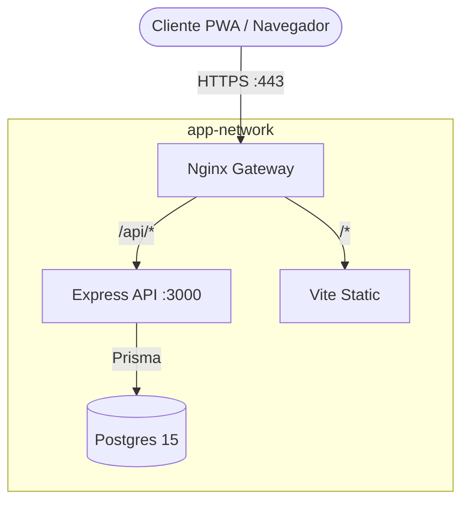

# Documentación Técnica - Gestión de Turnos Auteide (v1.0)

Este documento detalla la arquitectura, el modelo de datos y las reglas operativas de la versión v1.0 del proyecto "Gestión de Turnos Auteide".

---

## 1. Visión General y Stack Tecnológico

El proyecto es una **PWA (Progressive Web App)** integral dockerizada, diseñada para entornos de alto rendimiento en sucursales.

### Tecnologías Principales
- **Frontend:** React 18 (Vite), TailwindCSS, Lucide React.
- **Backend:** Node.js (Express.js) con arquitectura de API REST.
- **Base de Datos:** PostgreSQL 15 + Prisma ORM (v5).
- **Infraestructura:** Docker Compose + Nginx (Reverse Proxy & SSL).

### Diagrama de Arquitectura de Contenedores

---

## 2. Estructura del Código Fuente

- `frontend/src/pages/`: Vistas con **scroll interno** y **padding horizontal responsivo** para mejorar la UX.
- `backend/src/index.js`: Monolito de API que centraliza la lógica de negocio y tareas cron (limpieza de anuncios, backups).
- `prisma/schema.prisma`: Definición de esquemas y relaciones (User, Branch, Zone, SubZone, AuditLog, etc.).

---

## 3. Esquema de Base de Datos y Lógica de Subzonas

- **`User`:** Soporte para roles jerárquicos y estado `isActive`.
- **`ZoneDefinition` & `SubZone`:**
    - `SubZone` puede ser global (`branchId: null`) o específica.
    - **Filtrado de Subzonas (v1.0):**
        - El rol `admin` tiene visibilidad total de todas las subzonas.
        - Los demás roles están restringidos por `branchId` y `managedBranches` mediante un filtro `OR` en la consulta Prisma.

---

## 4. Sistema de Roles y Permisos (RBAC)

Se definen 5 niveles de acceso principales:

- **`employee`:** Usuario base.
- **`responsable`:** Gestión de una o varias sucursales.
- **`jefe_departamento` [NUEVO]:** Rol de gestión transversal con permisos similares a responsable pero orientado a la coordinación de departamentos específicos.
- **`administracion`:** Perfil técnico/administrativo para zona "Oficina".
- **`admin`:** Superusuario con acceso a logs, mantenimiento y **visibilidad total de subzonas**.

---

## 5. API Backend - Mejoras v1.0

- **Ordenación Alfabética:** Todos los listados de gestión (Sucursales, Zonas, Definiciones) se sirven ordenados por nombre (`asc`) por defecto.
- **Validación de Usuarios Inactivos:** El backend bloquea la creación de turnos para usuarios con `isActive: false` en el módulo `/shifts`.
- **Auditoría:** Registro de IP y detalles de payload en `AuditLog` para cada acción de creación/borrado.

---

## 6. Guía de Operaciones

- **Arranque:** `docker compose up -d`
- **Rebuild:** `docker compose up -d --build` (Tras cambios en `package.json`).
- **Migraciones en Producción:** `npx prisma migrate deploy` (NUNCA usar `migrate dev` en producción).
- **Backups:** Endpoint `/api/backup` que invoca `pg_dump` de forma interna.
 (`vite build`) ejecutada automáticamente al emplear el parámetro `--build` en docker-compose, o limpiando explícitamente la caché del navagador.
